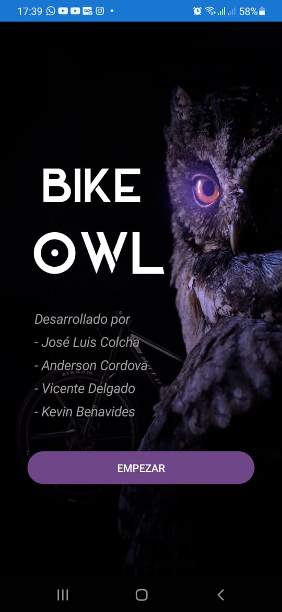
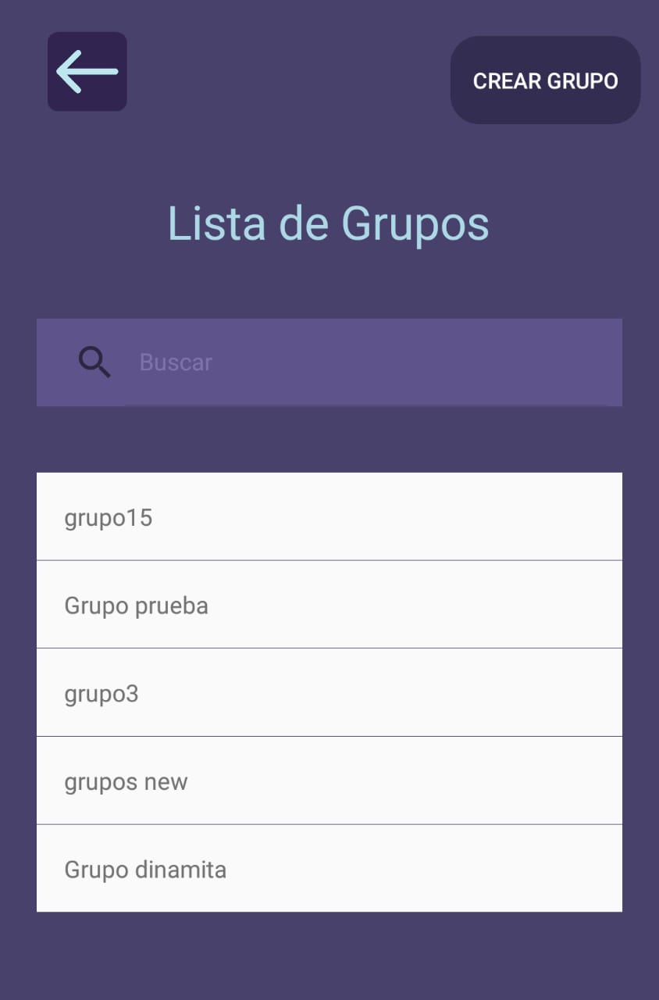
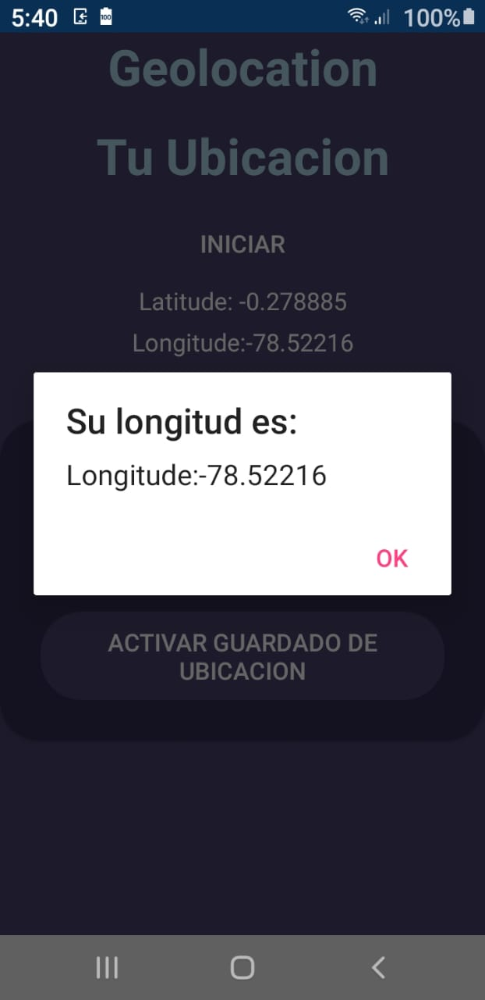
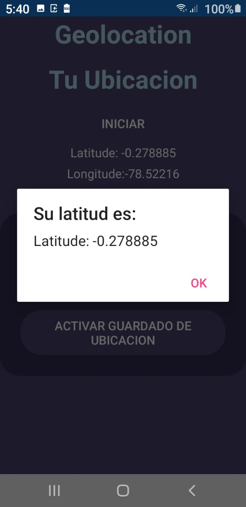

# BIKE OWL

Ejemplo de aplicativo para con las tecnologías de XamrinForms, Firebase &b Xamarin Essentials 

Manual Técnico --> https://youtu.be/40Yew3f9pWI 
 
Manual de Usuario --> https://youtu.be/WstKUq3LVc8  
 

 

### El proyecto en Xamarin incluye:

- Geolocation
- Routes Protection
- Ionicons
- Navigation
- Register
- Login

## Página de Inicio

 

## Register

 

## Login

 

## Lista de Grupos 

## Crear Grupo

 

## Geolocation

## Guardar datos 

Datos Respaldados en Firebase
 

